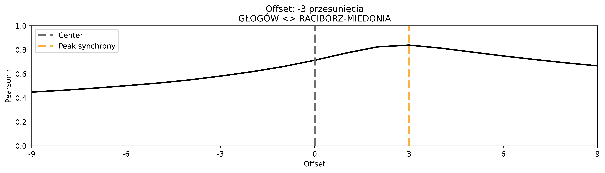
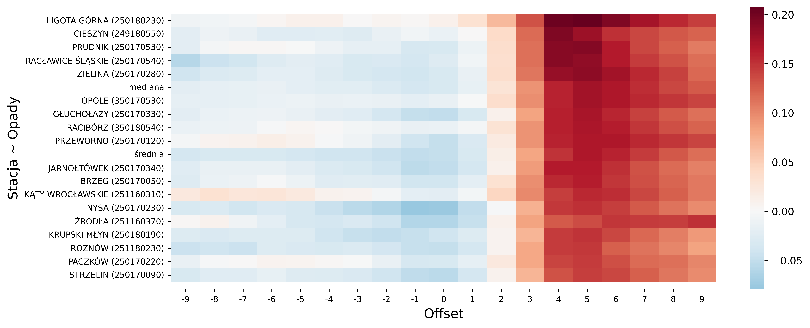
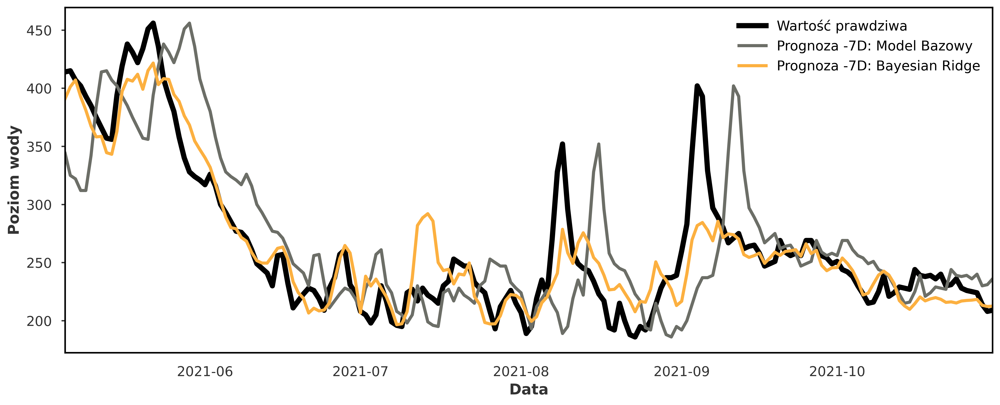

# CuValley-Batmaja

Projekt uczenia maszynowego do predykcji poziomu wody w Odrze zrealizowany w ramach Hackathonu [**CuValley Hack**](https://cuvalley.com/).

Rezultaty zostały przedstawione w interaktywnej aplikacji dostępnej pod adresem https://cuvalley-batmaja-kw5yuowusq-lm.a.run.app

## Spis Treści
* [O Projekcie](#o-projekcie)
* [Użyte Technologie](#użyte-technologie)
* [Aplikacja](#Aplikacja)
* [Materiały uzupełniające](#materiały-uzupełniające)

## O projekcie

Szeregi czasowe mają strukturę szeregów wielowymiarowych z zmiennych objaśniającymi (Multivariate TimeSeries with Covariates). Poziom rzeki w obu stacjach jest powiązany ze sobą, ponieważ pochodzą z tego samego procesu w rozumieniu szeregów czasowych. Opady wpływają na poziomy w obu stacjach pośrednio. Podczas eksploracyjnej analizy danych i korelacji krzyżowej udowodniliśmy zależności pomiędzy obiema stacjami oraz wpływem opadów na te stacje. Ponadto poziom wody w stacjach podlega sezonowości.

Korelacja krzyżowa pomiędzy stacjami:

Korelacja krzyżowa pomiędzy stacją w Głogowie a opadami (z uwzględnieniem zagregowanej średniej i mediany z wszystkich stacji):

Jako model wybrano **Bayesian Ridge**, który uwzględnia szeregi wielowymariowe (podobnie jak VARIMA). Wdrożono również model Bazowy (prognozuje ostatnią wartość ze zbioru treningowego) do celów porównawczych.

Dokonane walidacje czy backtesty nie niosły ze sobą wycieku danych (brak losowości), dlatego rezultaty są wiarygodne. Poniżej zaprezentowano backtesty dla zbioru testowego.

## Użyte Technologie

* Python 3.10

* Docker

* Hosting - Google Cloud Run

## Aplikacja

* Analiza Danych

* Ocena Modeli

* Prognoza Modeli

## Uruchomienie Projektu

* Instalacja zależności

pip install -r requirements.txt

* Uruchomienie aplikacji

cd Dash_app

python app.py

## Materiały uzupełniające:
- [Szeregi wielowymiarowe a wiele szeregów czasowych](https://unit8co.github.io/darts/userguide/timeseries.html#multivariate-time-series-vs-multiple-time-series)
- [Zmienne objaśniające dla szeregów czasowych](https://unit8co.github.io/darts/userguide/covariates.html)
